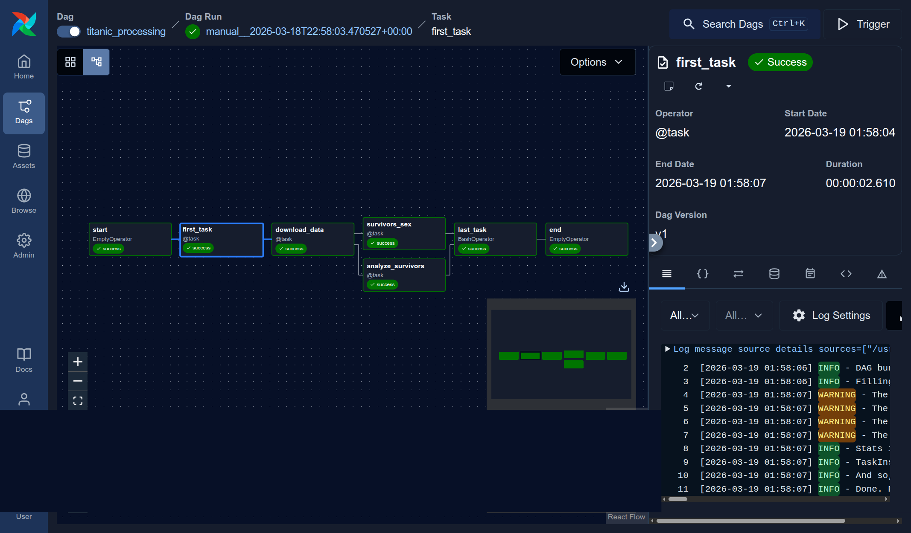

# Chapter 06 - Building Pipelines with Apache Airflow


<br/>

```
$ sudo vi /etc/hosts
127.0.0.1 postgres
``` 

<br/>

Install the Astro CLI

https://docs.astronomer.io/astro/cli/install-cli

<br/>

```
$ curl -sSL install.astronomer.io | sudo bash -s
```

<br/>

```
$ mkdir ~/tmp/airflow
$ cp -r ./dags ~/tmp/airflow/

$ cd ~/tmp/airflow

$ astro dev init
$ astro dev start
```

<br/>

**titanic_dag.py**



<br/>

```
$ vi requirements.txt
```

```
apache-airflow-providers-postgres
apache-airflow-providers-amazon
```

```
$ vi .env
```

```
AIRFLOW_VAR_AWS_ACCESS_KEY_ID=my-key
AIRFLOW_VAR_AWS_SECRET_ACCESS_KEY=my-secret
```

```
$ astro dev restart
```

```
// Проверка установки пакета
$ astro dev bash --scheduler
Execing into the scheduler container

astro@713417aabd1d:/usr/local/airflow$ pip list | grep postgres
apache-airflow-providers-postgres        6.6.1
```


<br/>

```
$ astro dev kill
```


<br/>

При старте airflow поднимается база postgres, к которой можно подключиться

// postgres / postgres
// localhost

<br/>

Airflow -> Admin -> Connections

<br/>

```
$ astro dev kill
```

<br/><br/>

---

<br/>

<a href="https://k8s.ru/">Предложить инженеру работу / подработку на проекте с kubernetes, microservices, machine learning, big data, golang</a>
