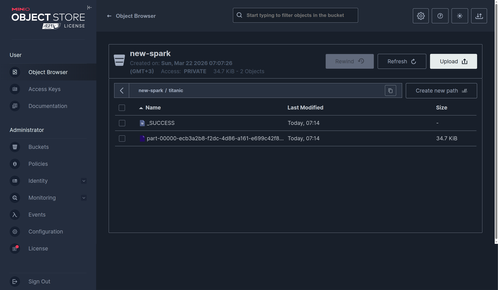

# Chapter 08 - Deploying the Big Data Stack on Kubernetes

<br/>

```
// Версия старше требует новую версию strimzi-cluster-operator, где уже нет zookeeper
$ export \
    PROFILE=${USER}-minikube \
    CPUS=4 \
    MEMORY=8G \
    HDD=20G \
    DRIVER=docker \
    KUBERNETES_VERSION=v1.31.0
```

<br/>

```
$ {
    minikube --profile ${PROFILE} config set memory ${MEMORY}
    minikube --profile ${PROFILE} config set cpus ${CPUS}
    minikube --profile ${PROFILE} config set disk-size ${HDD}

    minikube --profile ${PROFILE} config set driver ${DRIVER}

    minikube --profile ${PROFILE} config set kubernetes-version ${KUBERNETES_VERSION}
    minikube start --profile ${PROFILE} --embed-certs

    // Enable ingress
    minikube addons --profile ${PROFILE} enable ingress

    // Enable registry
    // minikube addons --profile ${PROFILE} enable registry

    // Enable metallb
    minikube addons --profile ${PROFILE} enable metallb
}
```

<br/>

### [Нужен addon Metal LB](//docs.k8s.ru/tools/containers/kubernetes/utils/metal-lb/minikube/setup/addon/)

<br/>

### [Нужно добавить MINIO для S3](//docs.gitops.ru/tools/containers/kubernetes/utils/minio/)


Создал bucket:

* spark
* spark-new
* airflow-logs

<br/>

### [OK!] Deploying Spark on Kubernetes

<br/>

```
$ helm install spark-operator https://github.com/kubeflow/spark-operator/releases/download/spark-operator-chart-1.1.27/spark-operator-1.1.27.tgz \
  --namespace spark-operator \
  --create-namespace \
  --set webhook.enable=true
```

<br/>

```
$ kubectl get pods -n spark-operator
NAME                                READY   STATUS      RESTARTS   AGE
spark-operator-6f5b9cf5f7-mppxm     1/1     Running     0          76s
spark-operator-webhook-init-mbkwg   0/1     Completed   0          2m1s
```

<br/>

```
$ cd Bigdata-on-Kubernetes/Chapter08/spark
```

<br/>

```
$ kubectl create secret generic aws-credentials --from-literal=aws_access_key_id=admin --from-literal=aws_secret_access_key="password123" -n spark-operator
```


<br/>

Создаю bucket spark и загружаю в него файл spark_job.py, предварительно заменив переменные <YOUR_BUCKET> <YOUR_NEW_BUCKET>

и 

https://raw.githubusercontent.com/neylsoncrepalde/titanic_data_with_semicolon/main/titanic.csv


<br/>

```yaml
$ cat <<EOF | kubectl apply -f -
apiVersion: "sparkoperator.k8s.io/v1beta2"
kind: SparkApplication
metadata:
  name: test-spark-job
  namespace: spark-operator
spec:
  volumes:
    - name: ivy
      emptyDir: {}
  sparkConf:
    spark.driver.extraJavaOptions: "-Divy.cache.dir=/tmp -Divy.home=/tmp"
    spark.kubernetes.allocation.batch.size: "10"
  hadoopConf:
    fs.s3a.impl: org.apache.hadoop.fs.s3a.S3AFileSystem
    # Обязательно: адрес вашего MinIO (тот, что выдал MetalLB)
    fs.s3a.endpoint: "http://192.168.49.20:9000"
    # Обязательно: для работы с MinIO через IP
    fs.s3a.path.style.access: "true"
    # Отключаем SSL, так как в локальном MinIO его обычно нет
    fs.s3a.connection.ssl.enabled: "false"
    # Подтягиваем ключи из вашего секрета автоматически для Hadoop
    fs.s3a.access.key: "admin"
    fs.s3a.secret.key: "password123"
  type: Python
  pythonVersion: "3"
  mode: cluster
  image: "docker.io/neylsoncrepalde/spark-operator:v3.1.1-hadoop3-aws-kafka"
  imagePullPolicy: Always
  mainApplicationFile: s3a://spark/spark_job.py
  sparkVersion: "3.1.1"
  restartPolicy:
    type: Never
  driver:
    envSecretKeyRefs:
      AWS_ACCESS_KEY_ID:
        name: aws-credentials
        key: aws_access_key_id
      AWS_SECRET_ACCESS_KEY:
        name: aws-credentials
        key: aws_secret_access_key
    cores: 1
    coreLimit: "1200m"
    memory: "1g"
    labels:
      version: 3.1.1
    serviceAccount: spark-operator-spark
    volumeMounts:
      - name: ivy
        mountPath: /tmp
  executor:
    envSecretKeyRefs:
      AWS_ACCESS_KEY_ID:
        name: aws-credentials
        key: aws_access_key_id
      AWS_SECRET_ACCESS_KEY:
        name: aws-credentials
        key: aws_secret_access_key
    cores: 1
    instances: 1
    memory: "1g"
    labels:
      version: 3.1.1
    volumeMounts:
      - name: ivy
        mountPath: /tmp
EOF
```

<br/>

```
$ kubectl get sparkapplication -n spark-operator
```

<br/>

```
// Ждем!
$ kubectl get sparkapplication -n spark-operator
NAME             STATUS      ATTEMPTS   START                  FINISH                 AGE
test-spark-job   COMPLETED   1          2026-03-22T04:12:47Z   2026-03-22T04:14:10Z   3m
```


<br/>

```
$ kubectl describe sparkapplication/test-spark-job -n spark-operator
```

<br/>

```
$ kubectl logs test-spark-job-driver -n spark-operator
root
 |-- PassengerId: integer (nullable = true)
 |-- Survived: integer (nullable = true)
 |-- Pclass: integer (nullable = true)
 |-- Name: string (nullable = true)
 |-- Sex: string (nullable = true)
 |-- Age: double (nullable = true)
 |-- SibSp: integer (nullable = true)
 |-- Parch: integer (nullable = true)
 |-- Ticket: string (nullable = true)
 |-- Fare: double (nullable = true)
 |-- Cabin: string (nullable = true)
 |-- Embarked: string (nullable = true)

*****************
Successfully written!
*****************
```



<br/>

```
$ kubectl delete sparkapplication/test-spark-job -n spark-operator
```

<br/>

### [FAIL!] Deploying Airflow on Kubernetes (не заработал)

```
$ helm repo add apache-airflow https://airflow.apache.org
```

<br/>

```
$ cd /home/marley/projects/dev/python/big_data/Bigdata-on-Kubernetes/Chapter08/airflow
```

<br/>

```
$ vi custom_values.yaml
```

<br/>

```
$ helm install airflow apache-airflow/airflow --namespace airflow --create-namespace -f custom_values.yaml
```

<br/>

Ошибка!

<br/>

```
$ kubectl get svc -n airflow
```


<br/>

### [OK!] Deploying Kafka on Kubernetes


https://artifacthub.io/packages/helm/strimzi/strimzi-kafka-operator


```
$ helm repo add strimzi https://strimzi.io/charts/
```

<br/>

```
// $ helm delete kafka -n kafka
$ helm install kafka strimzi/strimzi-kafka-operator --namespace kafka --create-namespace --version 0.44.0
```

<br/>

```
$ helm status kafka -n kafka
```

<br/>

```
$ watch -n 2 -c 'kubectl get pods -n kafka'
NAME                                        READY   STATUS    RESTARTS   AGE
strimzi-cluster-operator-7d9bbbdf5d-hxhxf   1/1     Running   0          108s
```

```
$ cd Bigdata-on-Kubernetes/Chapter08/kafka
```

```
// deploy the cluster to Kubernetes
$ kubectl apply -f kafka_jbod.yaml -n kafka
```

```
$ kubectl get kafka -n kafka
NAME            DESIRED KAFKA REPLICAS   DESIRED ZK REPLICAS   READY   METADATA STATE   WARNINGS
kafka-cluster   3                        3                          
```

<br/>

```
// Нужно ждать!
$ kubectl get pods -n kafka
NAME                                        READY   STATUS    RESTARTS   AGE
kafka-cluster-kafka-0                       1/1     Running   0          63s
kafka-cluster-kafka-1                       1/1     Running   0          63s
kafka-cluster-kafka-2                       1/1     Running   0          63s
kafka-cluster-zookeeper-0                   1/1     Running   0          87s
kafka-cluster-zookeeper-1                   1/1     Running   0          87s
kafka-cluster-zookeeper-2                   1/1     Running   0          87s
strimzi-cluster-operator-6f9fbb4c75-zxhh8   1/1     Running   0          13m
```

```
$ kubectl get svc -n kafka
NAME                                     TYPE           CLUSTER-IP       EXTERNAL-IP     PORT(S)                                        AGE
kafka-cluster-kafka-0                    LoadBalancer   10.110.8.234     192.168.49.21   9094:31956/TCP                                 2m19s
kafka-cluster-kafka-1                    LoadBalancer   10.111.210.63    192.168.49.22   9094:32576/TCP                                 2m19s
kafka-cluster-kafka-2                    LoadBalancer   10.104.36.248    192.168.49.23   9094:32678/TCP                                 2m19s
kafka-cluster-kafka-bootstrap            ClusterIP      10.108.187.242   <none>          9091/TCP,9092/TCP,9093/TCP                     2m19s
kafka-cluster-kafka-brokers              ClusterIP      None             <none>          9090/TCP,9091/TCP,8443/TCP,9092/TCP,9093/TCP   2m19s
kafka-cluster-kafka-external-bootstrap   LoadBalancer   10.109.196.85    192.168.49.20   9094:30646/TCP                                 2m19s
kafka-cluster-zookeeper-client           ClusterIP      10.110.241.105   <none>          2181/TCP                                       2m43s
kafka-cluster-zookeeper-nodes            ClusterIP      None             <none>          2181/TCP,2888/TCP,3888/TCP                     2m43s
```


<br/>

```
$ minikube --profile ${PROFILE} stop && minikube --profile ${PROFILE} delete
```


<br/><br/>

---

<br/>

<a href="https://k8s.ru/">Предложить инженеру работу / подработку на проекте с kubernetes, microservices, machine learning, big data, golang</a>
