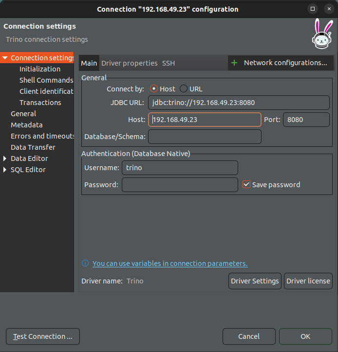
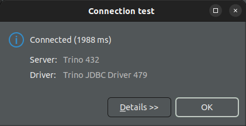

# Chapter 09 - Data Consumption Layer

### [FAIL!] Deploying Trino in Kubernetes

<br/>

```
$ helm repo add trino https://trinodb.github.io/charts
```

<br/>

```
$ cd Bigdata-on-Kubernetes/Chapter09/trino
```

<br/>

```
// $ helm uninstall trino -n trino
$ helm install trino trino/trino -f custom_values.yaml -n trino --create-namespace --version 0.19.0
```

<br/>

```
$ kubectl get pods -n trino
NAME                                READY   STATUS    RESTARTS   AGE
trino-coordinator-5864b8497-xvb4h   1/1     Running   0          3m36s
trino-worker-6dcf5978d5-dcwjc       1/1     Running   0          3m36s
trino-worker-6dcf5978d5-zl87k       1/1     Running   0          3m36s
```

<br/>

```
$ kubectl get svc -n trino
NAME    TYPE           CLUSTER-IP      EXTERNAL-IP     PORT(S)          AGE
trino   LoadBalancer   10.109.226.94   192.168.49.20   8080:31473/TCP   13m
```

<br/>

```
// trino
192.168.49.20:8080
```

Dbeaver создать новое соединение с типом trino, скачать драйвера и подключиться.

<br/>





<br/>

Download the dataset from https://github.com/neylsoncrepalde/titanic_data_with_semicolon and store the CSV file in an S3 bucket inside a folder named titanic.


```
SQL> select * from hive."bdok-database".titanic
```


```
SQL> select
    pclass,
    sex, COUNT(1) as people_count,
    AVG(age) as avg_age
from hive."bdok-database".titanic
group by pclass, sex
order by sex, pclass
```


<br/>

#### [FAIL!] Deploying Elasticsearch in Kubernetes

<br/>

https://artifacthub.io/packages/helm/elastic/eck-operator/2.12.1

<br/>

```
// Install elasticsearch operator
$ cd Chapter09
```

<br/>

```
// $ helm repo add elastic https://helm.elastic.co
```

<br/>

```
// Do not works for me, because Russia has been banned
// $ helm install elastic-operator elastic/eck-operator -n elastic --create-namespace --version 2.12.1
```

<br/>

```
$ helm install elastic-operator ./eck-operator-2.12.1/eck-operator -n elastic --create-namespace
```


<br/>

```
$ cd elasticsearch/
$ kubectl apply -f elastic_cluster.yaml -n elastic
$ kubectl apply -f kibana.yaml -n elastic
```

<br/>

```
$ kubectl get pods -n elastic
NAME                         READY   STATUS    RESTARTS   AGE
elastic-es-default-0         0/1     Pending   0          115s
elastic-es-default-1         0/1     Pending   0          115s
elastic-operator-0           1/1     Running   0          4m
kibana-kb-6c495c9bc4-csjs8   1/1     Running   0          112s
```

<br/>

```
$ kubectl get elastic -n elastic
NAME                                                 HEALTH    NODES   VERSION   PHASE             AGE
elasticsearch.elasticsearch.k8s.elastic.co/elastic   unknown   1       8.13.0    ApplyingChanges   7m16s

NAME                                  HEALTH   NODES   VERSION   AGE
kibana.kibana.k8s.elastic.co/kibana   green    1       8.13.0    16m
```

<br/>

```
$ kubectl get elasticsearch -n elastic
NAME      HEALTH   NODES   VERSION   PHASE   AGE
elastic   red      2       8.13.0    Ready   10m
```

<br/>

```
$ kubectl describe elastic -n elastic
```

<br/>

```
$ kubectl get secret elastic-es-elastic-user -n elastic -o go-template='{{.data.elastic | base64decode}}'
```


<br/>

```
$ kubectl get svc -n elastic
NAME                       TYPE           CLUSTER-IP       EXTERNAL-IP     PORT(S)          AGE
elastic-es-default         ClusterIP      None             <none>          9200/TCP         9m22s
elastic-es-http            ClusterIP      10.110.219.135   <none>          9200/TCP         9m24s
elastic-es-internal-http   ClusterIP      10.111.199.232   <none>          9200/TCP         9m24s
elastic-es-transport       ClusterIP      None             <none>          9300/TCP         9m24s
elastic-operator-webhook   ClusterIP      10.108.238.36    <none>          443/TCP          20m
kibana-kb-http             LoadBalancer   10.106.211.252   192.168.49.20   5601:31328/TCP   18m
```

<br/>

```
// Kibana will not accept regular HTTP protocol connections
// elastic / 
https://192.168.49.20:5601
```


<br/><br/>

---

<br/>

<a href="https://k8s.ru/">Предложить инженеру работу / подработку на проекте с kubernetes, microservices, machine learning, big data, golang</a>
