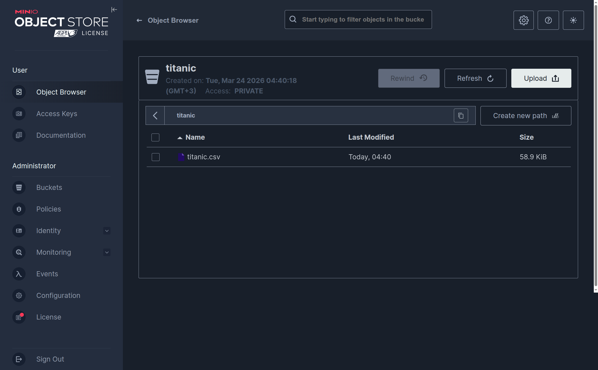
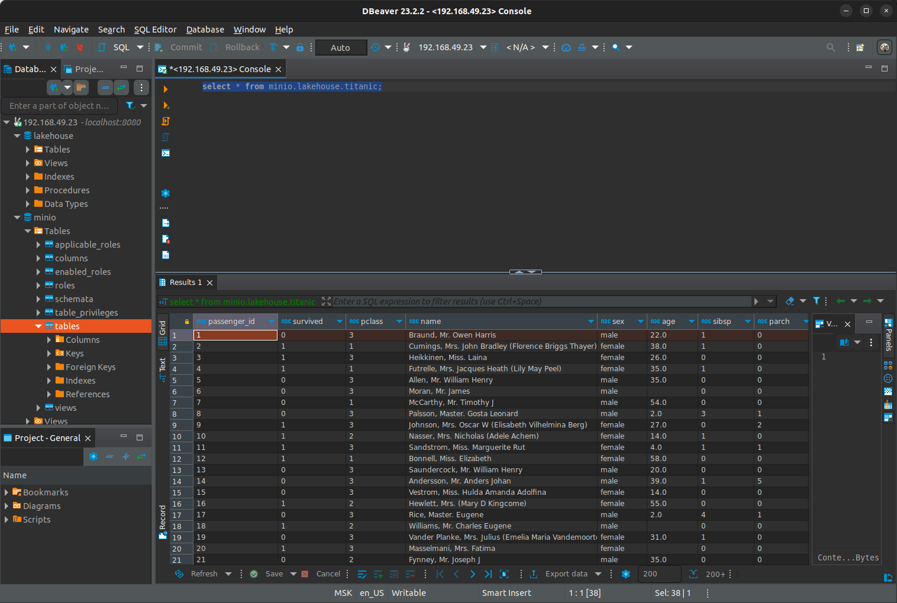
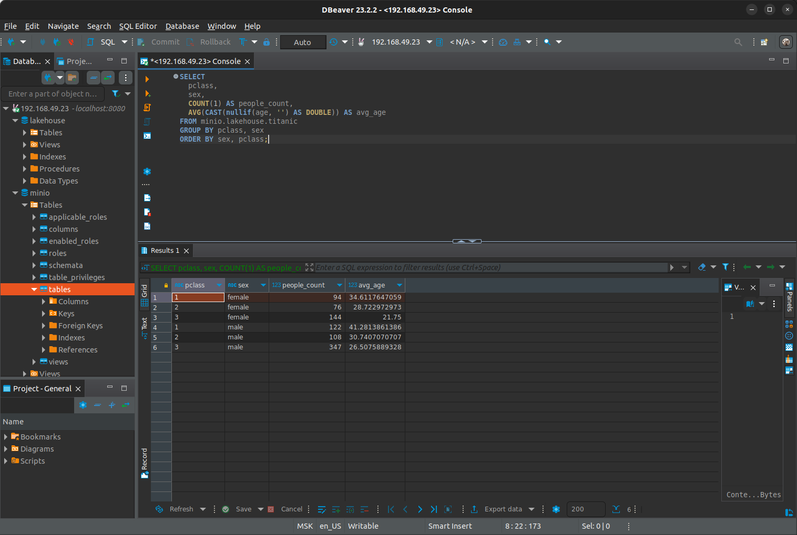
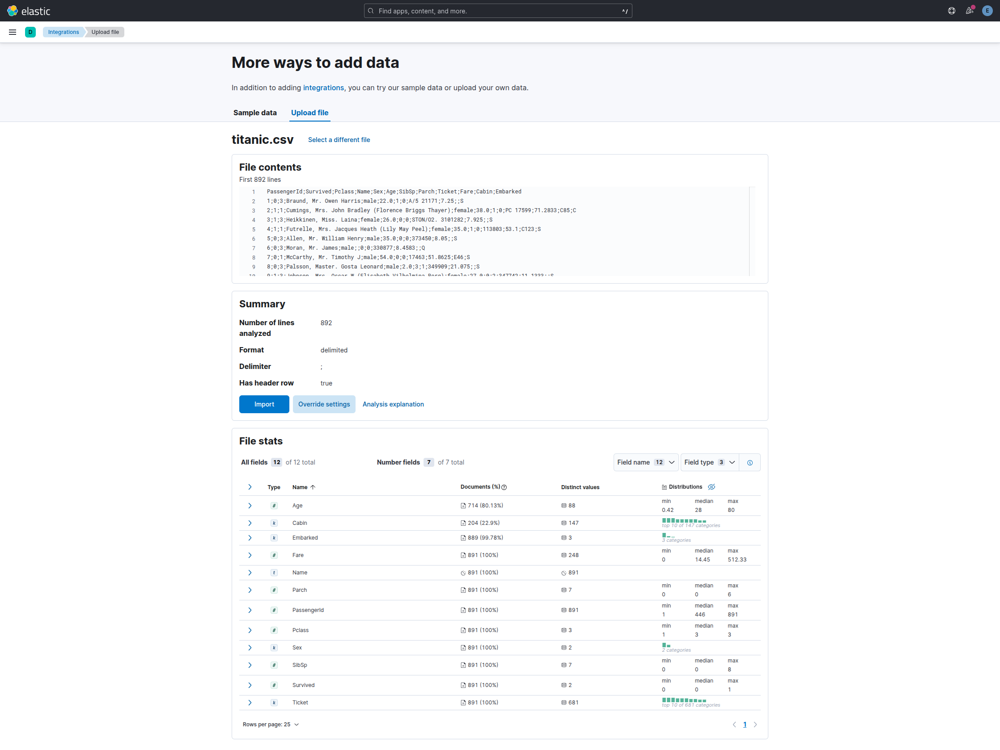
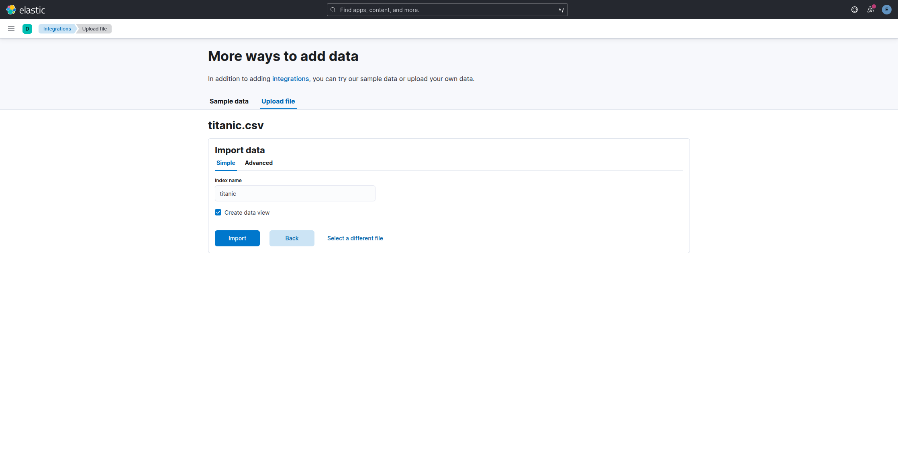
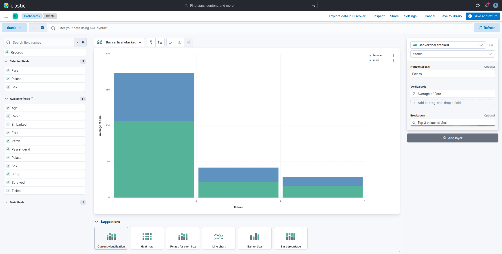

# Chapter 09 - Data Consumption Layer

### [OK!] Deploying Trino in Kubernetes


По доке:

https://github.com/webmakaka/data-platform-notes/tree/main/trino

Выполняем:

* Install Minio on Kubernetes
* Install Hive Metastore
* Install Trino


```
$ kubectl port-forward pod/trino-coordinator-57cc8c466f-hx98k 8080:8080
```

Dbeaver создать новое соединение с типом trino, скачать драйвера и подключиться.

<br/>

Только localhost, а не указанный IP


<br/>

Download the dataset from https://github.com/neylsoncrepalde/titanic_data_with_semicolon and store the CSV file in an S3 bucket inside a folder named titanic.





```sql
SQL> CREATE SCHEMA minio.lakehouse
WITH (location = 's3a://titanic/');

-- DROP TABLE minio.lakehouse.titanic
SQL> CREATE TABLE minio.lakehouse.titanic (
    passenger_id VARCHAR,
    survived VARCHAR,
    pclass VARCHAR,
    name VARCHAR,
    sex VARCHAR,
    age VARCHAR,
    sibsp VARCHAR,
    parch VARCHAR,
    ticket VARCHAR,
    fare VARCHAR,
    cabin VARCHAR,
    embarked VARCHAR
)
WITH (
    format = 'CSV',
    external_location = 's3a://titanic/',
    csv_separator = ';',
    skip_header_line_count = 1
);

SQL> select * from minio.lakehouse.titanic

SQL> SELECT
  pclass,
  sex,
  COUNT(1) AS people_count,
  AVG(CAST(nullif(age, '') AS DOUBLE)) AS avg_age
FROM minio.lakehouse.titanic
GROUP BY pclass, sex
ORDER BY sex, pclass;
```







<br/>

#### [OK!] Deploying Elasticsearch in Kubernetes

<br/>

https://artifacthub.io/packages/helm/elastic/eck-operator/2.12.1

<br/>

```
// Install elasticsearch operator
$ cd Chapter09
```

<br/>

```
// $ helm repo add elastic https://helm.elastic.co
```

<br/>

```
// Do not works for me, because Russia has been banned
// $ helm install elastic-operator elastic/eck-operator -n elastic --create-namespace --version 2.12.1
```

<br/>

```
$ helm install elastic-operator ./eck-operator-2.12.1/eck-operator -n elastic --create-namespace
```


<br/>

```
$ cd elasticsearch/
$ kubectl apply -f elastic_cluster.yaml -n elastic
$ kubectl apply -f kibana.yaml -n elastic
```

<br/>

```
$ kubectl get pods -n elastic
```

<br/>

```
$ kubectl get elastic -n elastic
```

<br/>

```
$ kubectl get elasticsearch -n elastic
```

<br/>

```
$ kubectl describe elastic -n elastic
```

<br/>

```
$ kubectl get secret elastic-es-elastic-user -n elastic -o go-template='{{.data.elastic | base64decode}}'
```

<br/>

```
$ kubectl get svc -n elastic
```

<br/>

```
// Kibana will not accept regular HTTP protocol connections
// elastic / 
https://192.168.49.20:5601
```

KIBANA 

--> Explore on my own

Data Views

https://192.168.49.20:5601/app/management/kibana/dataViews

Upload a file

https://github.com/neylsoncrepalde/titanic_data_with_semicolon







Dashboards -> Create a dashboard -> Create visualization.



<br/><br/>

---

<br/>

<a href="https://k8s.ru/">Предложить инженеру работу / подработку на проекте с kubernetes, microservices, machine learning, big data, golang</a>
