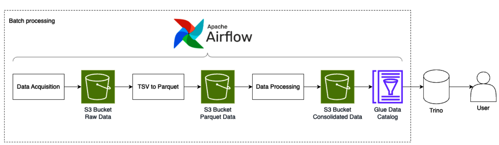
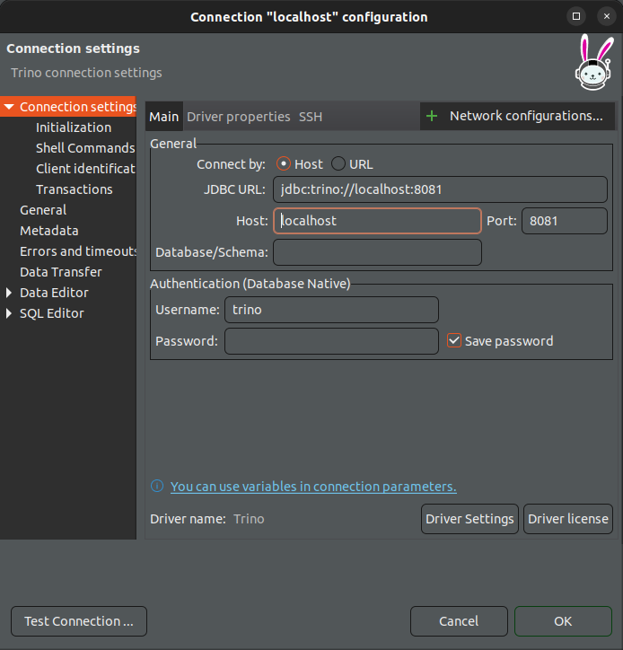
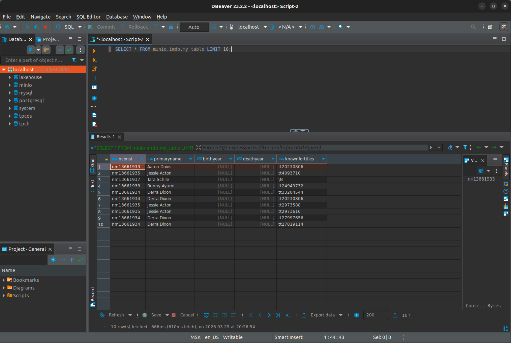

# Chapter 10 - Building a Big Data Pipeline on Kubernetes - Building a batch pipeline


<br/>




<br/>

### Checking the deployed tools

<br/>

* Minio
* Hive Metastore
* Trino
* AirFlow
* Spark

<br/>

**Minio**

```
Crete bucket: imdb-datasets, airflow-logs, spark-jobs
```

<br/>

Загружаю файлы из spark_code:

spark_imdb_consolidated_table.py
spark_imdb_tsv_parquet.py

в s3a://spark-jobs/


<br/>


**Spark**


<br/>

```bash
$ kubectl create secret generic aws-credentials \
  --from-literal=aws_access_key_id='admin' \
  --from-literal=aws_secret_access_key='password' \
  -n spark-operator
```

<br/>

```yaml
$ cat << 'EOF' | kubectl apply -f -
apiVersion: v1
kind: ServiceAccount
metadata:
  name: spark
  namespace: spark-operator
---
apiVersion: rbac.authorization.k8s.io/v1
kind: Role
metadata:
  name: spark-role
  namespace: spark-operator
rules:
  - apiGroups: [""]
    resources: ["pods", "services", "configmaps", "secrets"]
    verbs: ["*"]
---
apiVersion: rbac.authorization.k8s.io/v1
kind: RoleBinding
metadata:
  name: spark-role-binding
  namespace: spark-operator
subjects:
  - kind: ServiceAccount
    name: spark
    namespace: spark-operator
roleRef:
  kind: Role
  name: spark-role
  apiGroup: rbac.authorization.k8s.io
EOF
```


<br/>

**AirFlow**

```
gitSync:
***
    repo: https://github.com/webmakaka/Bigdata-on-Kubernetes.git
***
    subPath: "Chapter10 - Building a Big Data Pipeline on Kubernetes/batch/dags"
***
```


<br/>

```bash
// $ helm install airflow apache-airflow/airflow --namespace airflow --create-namespace -f airflow_deployment/custom_values.yaml --version 1.13.1
```

<br/>

```bash
// $ helm uninstall airflow --namespace airflow
$ helm install airflow --namespace airflow --create-namespace -f airflow_deployment/custom_values.yaml ../../kubernetes-data-platform/helm-charts/airflow/
```

<br/>

```
// Roles
$ kubectl apply -f ./airflow_deployment/rolebinding_for_airflow.yaml
```


<br/>

```
$ kubectl port-forward svc/airflow-webserver 8080:8080 -n airflow
```

<br/>

```
// OK!
// admin / admin
http://localhost:8080/
```

<br/>

7 минут выполняется tsvs_to_parquet с максимально отключенными дополнительными действиями.

<br/>

В AWS Glue Crawler делает две вещи: сканирует S3 и обновляет метаданные в Glue Data Catalog. В стеке Minikube + MinIO + Hive Metastore + Trino роль «каталога» выполняет Hive Metastore (HMS), а роль движка для запросов — Trino.

<br/>

**Trino**

<br/>

```
$ kubectl get pods -n trino
NAME                                 READY   STATUS    RESTARTS   AGE
trino-coordinator-57cc8c466f-l4rkx   1/1     Running   0          13m
trino-worker-9b6b9f57-fdpdq          1/1     Running   0          13m
trino-worker-9b6b9f57-vg5p6          1/1     Running   0          13m
```

<br/>

**Подключаюсь dbeaver**


<br/>

```
$ kubectl port-forward pod/trino-coordinator-57cc8c466f-l4rkx 8081:8080 -n trino
```

<br/>



<br/>

```sql
SQL> CREATE SCHEMA IF NOT EXISTS minio.imdb
WITH (location = 's3a://imdb-datasets/');
```

<br/>

```sql
-- DROP TABLE minio.imdb.my_table
SQL> CREATE TABLE minio.imdb.my_table (
  nconst VARCHAR,
  primaryName VARCHAR,
  birthYear INTEGER,
  deathYear INTEGER,
  knownForTitles VARCHAR
)
WITH (
  format = 'PARQUET',
  external_location = 's3a://imdb-datasets/silver/imdb/consolidated/'
);
```

<br/>

```sql
SQL> SELECT * FROM minio.imdb.my_table LIMIT 10;
```

<br/>




<br/>

В AWS Glue Crawler — это «робот-разведчик». Его задача: зайти в S3, просканировать файлы, угадать их формат (Parquet, CSV), вытащить названия колонок и записать всё это в общую базу метаданных (Glue Data Catalog). Без этого другие сервисы (Athena, Redshift) просто не будут знать, что в S3 лежат таблицы.


<br/><br/>

---

<br/>

<a href="https://k8s.ru/">Предложить инженеру работу / подработку на проекте с kubernetes, microservices, machine learning, big data, golang</a>
