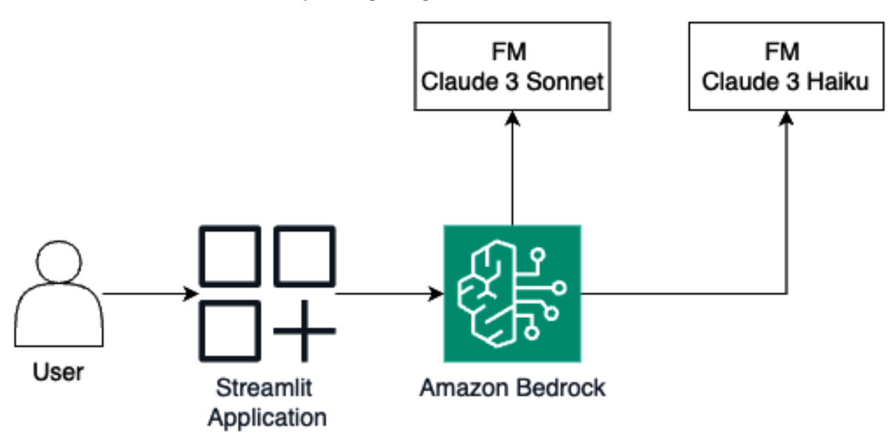
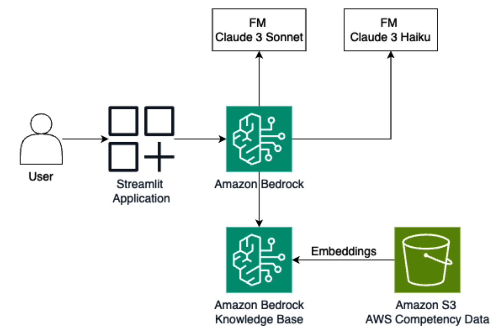
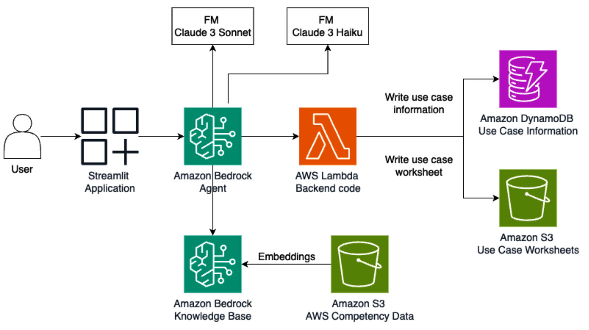

# Chapter 11 - Generative AI on Kubernetes

<br/>

### Building a generative AI application on Kubernetes with Streamlit

<br/>




<br/>

```
$ pip install -r requirements.txt
$ streamlit run main.py
```

<br/>

```
$ docker build --platform linux/amd64 -t <YOUR_USERNAME>/chat-with-claude:v1 .
$ docker push <YOUR_USERNAME>/chat-with-claude:v1
```

<br/>

```
$ kubectl create namespace genai
$ kubectl create secret generic aws-credentials --from-literal=aws_access_key_id=<YOUR_ACCESS_KEY_ID> --from-literal=aws_secret_access_key="<YOUR_SECRET_ACCESS_KEY>" -n genai
$ kubectl apply -f deploy_chat_with_claude.yaml -n genai
```

<br/>

```
$ kubectl get svc -n genai
```

<br/>

### Building RAG with Knowledge Bases for Amazon Bedrock


<br/>




<br/>

```
$ pip install "beautifulsoup4==4.12.2"
```


<br/>

```
$ python get_competency_data.py
```

<br/>

```
$ kubectl create configmap kb-config --from-literal=kb_id=<YOUR_KB_ID> -n genai
```

<br/>

```
$ kubectl apply -f deploy_chat_with_claude.yaml -n genai
```

<br/>

```
$ kubectl get svc -n genai
```

<br/>

### Building action models with agents

<br/>



<br/>

```
$ kubectl create configmap agent-config --from-literal=agent_alias_id=<YOUR_ALIAS_ID> --from-literal=agent_id=<YOUR_AGENT_ID> -n genai
```

<br/>

```
$ kubectl apply -f deploy_agent.yaml -n genai
```

<br/>

```
$ kubectl get svc -n genai
```
