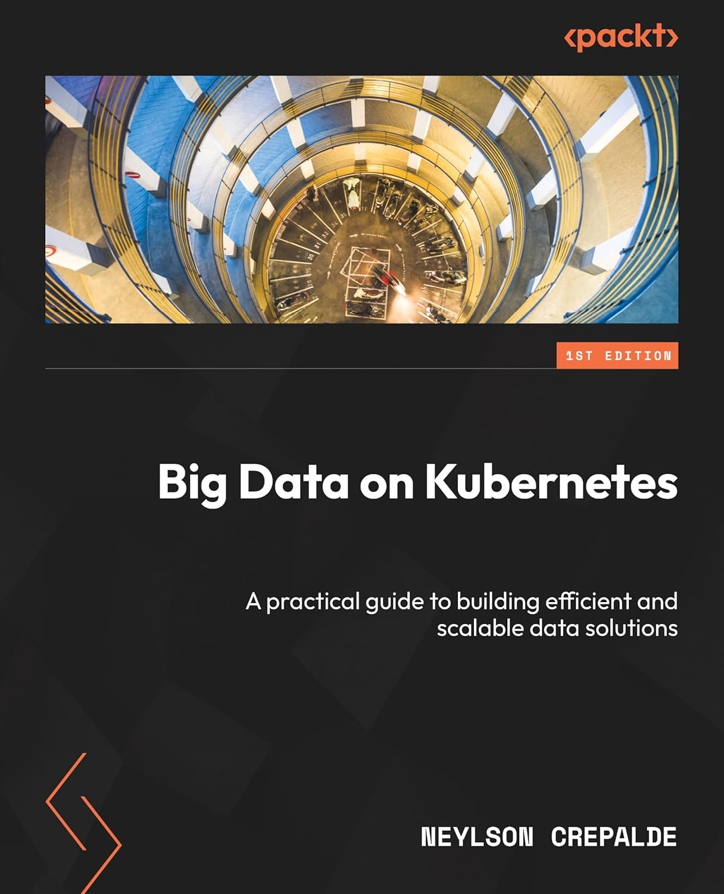

# [Book][Neylson Crepalde] Big Data on Kubernetes [ENG, 2024]

**A practical guide to building efficient and scalable data solutions**

## What is this book about?

With step-by-step instructions and examples, this book will teach you the skills needed to build and deploy complex data pipelines on Kubernetes, resulting in efficient and scalable big data solutions.

This book covers the following exciting features:
* Install and use Docker to run containers and build concise images
* Gain a deep understanding of Kubernetes architecture and its components
* Deploy and manage Kubernetes clusters on different cloud platforms
* Implement and manage data pipelines using Apache Spark and Apache Airflow
* Deploy and configure Apache Kafka for real-time data ingestion and processing
* Build and orchestrate a complete big data pipeline using open-source tools
* Deploy Generative AI applications on a Kubernetes-based architecture

 

## Chapters:

**Part 1: Docker and Kubernetes**

<ol>
  <li>✅ Getting Started with Containers</li>
  <li>📖 Kubernetes Architecture</li>
  <li>✅ Getting Hands-On with Kubernetes</li>
</ol>

**Part 2: Big Data Stack**

<ol start="4">
  <li>📖 The Modern Data Stack</li>
  <li>✅ Big Data Processing with Apache Spark</li>
  <li>✅ Building Pipelines with Apache Airflow</li>
  <li>✅ Apache Kafka for Real-Time Events and Data Ingestion</li>
</ol>

**Part 3: Connecting It All Together**

<ol start="8">
  <li>✅ Deploying the Big Data Stack on Kubernetes</li>
  <li>✅ Data Consumption Layer</li>
  <li>✅ Building a Big Data Pipeline on Kubernetes</li>
  <li>⏸️ Generative AI on Kubernetes</li>
  <li>📖 Where to Go from Here</li>
</ol>

  

---

 

<a href="https://k8s.ru/">Предложить инженеру работу / подработку на проекте с kubernetes, microservices, machine learning, big data, golang</a>
